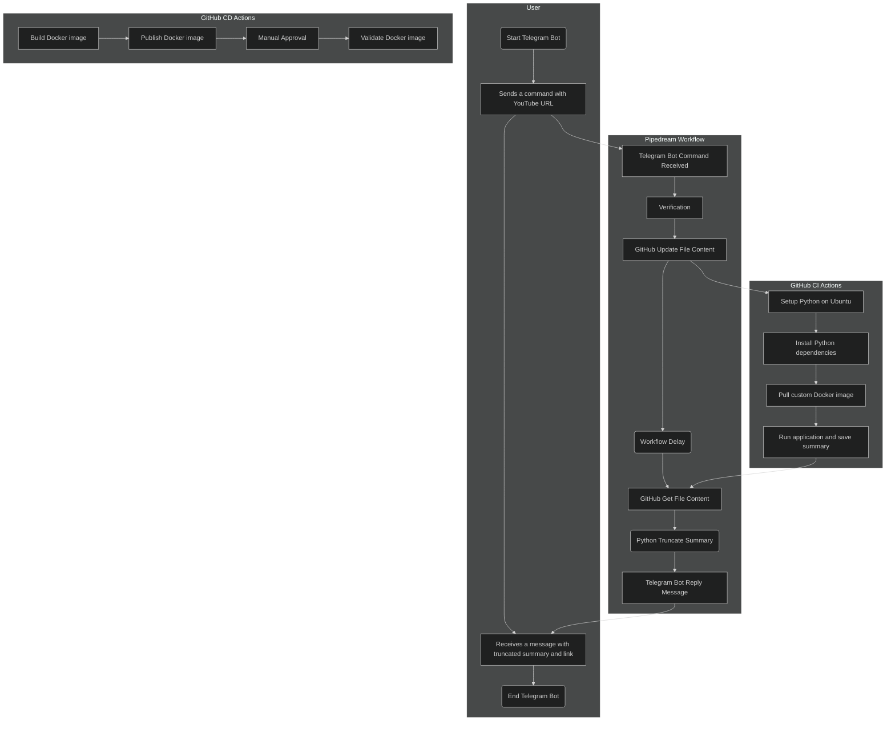

# playscribe

---
# 1. Introduction
## 1.1. Purpose

This document describes the `playscribe` automation and manual services that is provided for DevSecOps Engineer and User.

## 1.2. Audience

The audience for this document includes:

* User who will send a command with YouTube URL via a Telegram Bot, and receive a text with summarization of its transcript.

* DevSecOps Engineer who will design system workflows, configure and manage any SaaS or selfhosted services, and plan for disaster recovery.

---
# 2. System Overview
## 2.1. Benefits and Values

1. This summarization-as-a-service leverages on and applies a similar design from the [SudokuCliBot](https://dennislwm.netlify.app/posts/look-mum-no-servers/) automation to its workflow.

2. This service uses resources in both a free tier and a pay-per-usage tier by cloud SaaS providers:

  |   Free    | Pay-per-usage |
  |:---------:|:-------------:|
  | Pipedream |    ChatGPT    |
  |  GitHub   |               |
  | Telegram  |               |

3. This service is inexpensive, easy to implement, and can be duplicated for other services.

4. This service does not require implementing a custom frontend as the User will interact with a Telegram Bot.

5. This service does not require a backend server as the processing will be performed using ephemeral resources.

## 2.2. Workflow

This project uses several methods and products to optimize your workflow.

* Uses a version control system (**GitHub**) to track your changes and collaborate with others.
* Uses a diagram as code tool (**Mermaid**) to draw any system design or diagram.
* Uses a Python LLM-enabled CLI (**[fabric](https://github.com/danielmiessler/fabric)**) to automate summarization of a transcript.
* Uses a cloud LLM (**ChatGPT**) to provide an LLM API function.
* Uses a build tool (**Makefile**) to automate your build tasks.
* Uses a containerization platform (**Docker**) to run your application in any environment.
* Uses a continuous delivery pipeline (**GitHub Actions**) to download and summarize a YouTube transcript.
* Uses a continuous integration pipeline (**GitHub Actions**) to automate your Docker image build and deployment.
* Uses an artifactory (**Docker Hub**) to store and pull your image.
* Uses a cloud workflow automation and integration tool (**Pipedream**) to integrate the different services.
* Uses a cloud message application (**Telegram**) as a chat messaging service.
* Uses a cloud messaging bot (**Telegram Bot**) for a summarization as a service.

## 2.3. Limitation

This project has several limitations:

* The Telegram Bot has a content limit for messages sent to the User.
* The pipeline job may exceed the time of the fixed delayed step in the workflow.
* The message is truncated after `40` lines and will include a link to the file `examples/result.txt`. However, the content of this file may be overridden by another pipeline.
* The workflow system does not allow conditional branches.

## 2.4. Security

* A manual approval is required by at least one specified GitHub user in the CD pipeline to deploy a Docker image to Docker Hub.
* A verification step that checks the `username` with a list of allowed Telegram users in the Pipedream workflow.

## 2.5. High Level Overview of System

This is a high level overview of the system design and resources:

1. The User sends a command with YouTube URL, i.e. `/<command> <URL>`, to a Telegram Bot that will trigger an automation workflow.

2. The workflow updates the file content of this GitHub project, which will trigger a CI pipeline.

3. The CI pipeline runs the application and saves the summary in a file `examples/result.txt`.

4. After a delayed step, the workflow automatically reads, and truncates the file content of the summary.

5. The workflow then replies the User with a message containing the truncated summary and a link.



---
# 3. User Personas
## 3.1 RACI Matrix

|           Category           |                          Activity                           | User | DevSecOps |
|:----------------------------:|:-----------------------------------------------------------:|:----:|:---------:|
| Installation & Configuration |     [Add a Telegram user to the verification step][i01]     |      |    R,A    |
|          Execution           | [Download an autogenerated subtitle file from YouTube][e01] |      |    R,A    |
|          Execution           |           [Convert a subtitle file to text][e02]            |      |    R,A    |
|    Maintenance & Updates     |      [Schedule a pipeline to build Docker image][m01]       |      |    R,A    |

[i01]: #51-add-a-telegram-user-to-the-verification-step
[e01]: #61-download-an-autogenerated-subtitle-file-from-youtube
[e02]: #62-convert-a-subtitle-file-to-text
[m01]: #71-schedule-a-pipeline-to-build-docker-image

---
# 4. Requirements
## 4.1. Local workstation

* [jq](https://jqlang.github.io/jq)
* [yt-dlp](https://github.com/yt-dlp/yt-dlp)

---
# 5. Installation and Configuration
# 5.1. Add a Telegram user to the verification step

1. Open a browser and navigate to your [Pipedream console](https://pipedream.com).

2. Select your project `Telegram-Bot` > Resources > Select your workflow.

3. Edit the code for `Verification` > Add a `username` to the list of allowed Telegram users.

4. Click **Deploy** to update any changes your workflow.

---
# 6. Execution
## 6.1. Download an autogenerated subtitle file from YouTube

1. Open a terminal and run the command `yt-dlp --version` to check if it is installed.

```sh
2023.10.1
```

2. Type the following command to download the autogenerated subtitle of a YouTube video. Replace the YOUTUBE_URL with any YouTube link, e.g. `https://www.youtube.com/watch?v=x3vnCKivCjs`.

```sh
yt-dlp --write-auto-sub --skip-download [YOUTUBE_URL]
```

You should see an output similar to below.

```sh
[youtube] Extracting URL: https://www.youtube.com/watch?v=x3vnCKivCjs
[youtube] x3vnCKivCjs: Downloading webpage
[youtube] x3vnCKivCjs: Downloading ios player API JSON
[youtube] x3vnCKivCjs: Downloading android player API JSON
[youtube] x3vnCKivCjs: Downloading m3u8 information
[info] x3vnCKivCjs: Downloading subtitles: en
[info] x3vnCKivCjs: Downloading 1 format(s): 22
[info] Writing video subtitles to: The Fastest Way to Lose Belly Fat [x3vnCKivCjs].en.vtt
[download] Destination: The Fastest Way to Lose Belly Fat [x3vnCKivCjs].en.vtt
[download] 100% of   85.84KiB in 00:00:00 at 879.88KiB/s
```

The subtitle file name is created using the video title and code, e.g. `The Fastest Way to Lose Belly Fat [x3vnCKivCjs].en.vtt`.

If you open the `vtt` file, you'll notice that it contains metatags that makes it hard to read. You'll have to convert this `vtt` file to a text file using a Python script.

## 6.2. Convert a subtitle file to text

> Note: The Python script below has been deprecated in favour of a JSON method using `jq`.

Fortunately, there is a [Python script](https://gist.github.com/glasslion/b2fcad16bc8a9630dbd7a945ab5ebf5e) that converts youtube subtitle file (`vtt`) to plain text. Credit to [glasslion](https://gist.github.com/glasslion) for making it open-source.

1. Open a terminal and run the command `jq --version && yt-dlp --version` to check if both apps are installed.

```sh
jq-1.6
2023.10.1
```

2. In your terminal, type the following command. Replace the YOUTUBE_URL with any YouTube link, e.g. `https://www.youtube.com/watch?v=x3vnCKivCjs`.

```sh
yt-dlp --skip-download --write-auto-sub --quiet --sub-format json3 [YOUTUBE_URL]
```

3. Type the following command to convert the subtitle file to text. Replace the JSON_FILE with your subtitle file, e.g. `The\ Fastest\ Way\ to\ Lose\ Belly\ Fat\ \[x3vnCKivCjs\].en.json3`.

```sh
jq -r '.events[]|select(.segs and.segs[0].utf8!="\n")|[.segs[].utf8]|join("")' [JSON_FILE] \
|paste -sd\  -|fold -sw60
```

4. If successful, you should see an output similar to below.

```txt
today I'm going to share with you the absolute fastest way
to lose your belly now you could have the best willpower
the best discipline really want it really bad and never
really see any results because you're missing the technique
you're missing the strategy I'm the perfect example I took
guitar lessons for six years right as a teenager and I
never really progressed or never really went anywhere
because the techniques that were taught to me were just not
that great great the same thing happened with tennis in
college I was never taught the right technique and so I
...
```

---
# 7. Maintenance & Updates
# 7.1. Schedule a pipeline to build Docker image

1. Edit the `.github/workflows/dockerhub.yml` file.

```diff
on:
  push:
    branches: [ main ]
    paths: [ Dockerfile, .github/workflows/dockerhub.yml ]
+ schedule: [ cron:  '1 0 * * 5' ]  # At 01:00 on Friday
```

2. Run the `git` add, commit and push to update the file in GitHub repository.

3. If the CD pipeline fails, you may receive a notification based on your [settings](https://github.com/settings/notifications).

---
# 8. References

The following resources were used as a single-use reference.

|                                         Title                                         |    Author     |
|:-------------------------------------------------------------------------------------:|:-------------:|
| [Look Mum, No Servers! Create a Telegram Bot to communicate with GitHub Actions][r01] |  Dennis Lee   |
|          [How to extract closed caption transcript from YouTube video?][r02]          | StackOverflow |

[r01]: https://dennislwm.netlify.app/posts/look-mum-no-servers
[r02]: https://stackoverflow.com/questions/9611397/how-to-extract-closed-caption-transcript-from-youtube-video